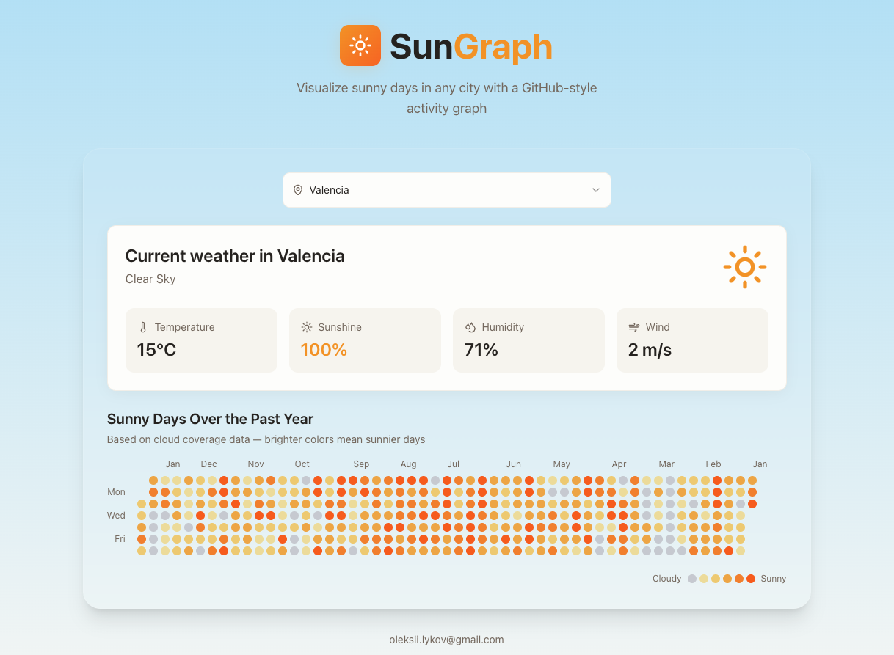

# ☀️ SunGraph

Visualize sunny days in any city with a GitHub-style activity graph. Track weather patterns and sunshine history with beautiful, interactive visualizations.



## ✨ Features

- **GitHub-style Weather Graph** — View sunny day patterns over the past year
- **Real-time Weather Data** — Current temperature, humidity, wind speed, and cloud coverage
- **Multiple Cities** — Search and compare weather across different locations
- **Beautiful UI** — Built with React, TypeScript, Tailwind CSS, and shadcn/ui
- **Historical Analysis** — Daily sunshine percentage based on cloud coverage data

## 🚀 Tech Stack

### Frontend
- React 18 + TypeScript
- Vite
- Tailwind CSS + shadcn/ui
- TanStack Query
- Recharts for visualizations

### Backend
- FastAPI (Python)
- SQLite database
- Weather API integration
- Automated data collection workers

## 🛠️ Getting Started

### Prerequisites
- Node.js 18+ / Bun
- Python 3.9+

### Frontend Setup
```bash
cd frontend
npm install
npm run dev
```

### Backend Setup
```bash
cd backend
pip install -r requirements.txt
python server.py
```

The app will be available at `http://localhost:5173`

## 📊 How It Works

SunGraph collects weather data for selected cities and stores daily sunshine percentages based on cloud coverage. The data is visualized in a GitHub contribution graph style, where:

- **Brighter colors** = Sunnier days (less cloud coverage)
- **Darker colors** = Cloudier days
- Each cell represents one day over the past year

## 📧 Contact

oleksii.lykov@gmail.com

---

Made with ☀️ by Oleksii Lykov
